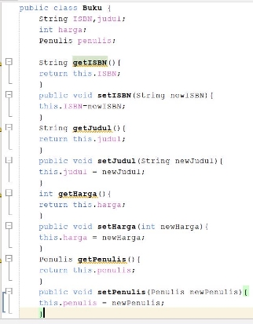

NAMA   : Fransiscus Farrel Edric w NIM   : 2241720032

KELAS   : 2C 

MATERI  : UTS 

Soal 1 

Jawab  

Fungsi diatas memerlukan adanya return statement untuk mengembalikan nilai, karena fungsi tersebut bertipe float dan bukan void 

Soal 2 

Jawab  

` `jika yang dimaksud dengan jumlah adalah total penjumlahan semua angka dalam array maka kodenya 

Untuk menghitung jumlah dari banyaknya elemen dalam array adalah menggunakan kode 

Soal 3 

Jawaban 

Hasilnya adalah **50** yang diperoleh dari pertama fungsi hitung() dari class Class dan dilanjutkan dalam fungsi hitungY() dalam class ClassY. 

Soal 4 

Jawban 

Soal 5 

Class Buku 

Class Penulis 

