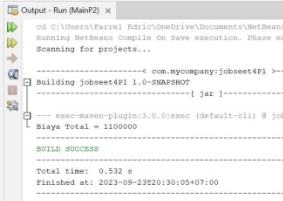
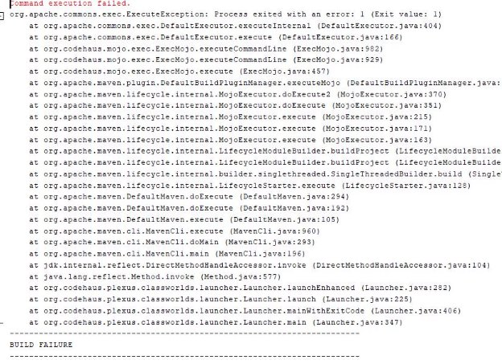

NAMA NIM 

KELAS MATER

I Percobaan 1 

Class Laptop  

- Fransiscus Farrel Edric W
- 2241720032 
- 2C 
- Relasi Kelas

/\* 

* Click nbfs://nbhost/SystemFileSystem/Templates/Licenses/license-default.txt to change this 

license 

* Click 

nbfs://nbhost/SystemFileSystem/Templates/Project/Maven2/JavaApp/src/main/java/${packagePath} /${mainClassName}.java to edit this template 

` `\*/ 

package percobaan1; 

/\*\* 

` `\* 

* @author Farrel Edric 

` `\*/ 

public class Laptop { 

private String merk; private Processor proc; 

`    `public String getMerk() {         return merk; 

`    `} 

`    `public void setMerk(String merk) {         this.merk = merk; 

`    `} 

`    `public Processor getProc() {         return proc; 

`    `} 

`    `public void setProc(Processor proc) {         this.proc = proc; 

`    `} 

`    `Laptop(){ 

`    `} 

`    `public Laptop(String merk, Processor proc) { 

`        `this.merk = merk; 

`        `this.proc = proc; 

`    `} 

`    `public void info(){ 

`        `System.out.println("Merk Laptop = " + merk);         proc.info(); 

`    `} 

} 

Class processor 

/\* 

* Click nbfs://nbhost/SystemFileSystem/Templates/Licenses/license-default.txt to change this 

license 

* Click nbfs://nbhost/SystemFileSystem/Templates/Classes/Class.java to edit this template 

` `\*/ 

package percobaan1; 

/\*\* 

` `\* 

* @author Farrel Edric 

` `\*/ 

public class Processor {     private String merk; 

`    `private double cache; 

`    `Processor(){} 

`    `public Processor(String merk, double cache) {         this.merk = merk; 

`        `this.cache = cache; 

`    `} 

`    `public String getMerk() {         return merk; 

`    `} 

`    `public void setMerk(String merk) {         this.merk = merk; 

`    `} 

`    `public double getCache() {         return cache; 

`    `} 

`    `public void setCache(double cache) {         this.cache = cache; 

`    `} 

`    `public void info(){ 

`        `System.out.printf("Merk Processor = %s\n", merk); 

`        `System.out.printf("Cache Memory = %.2f\n", cache);     } 

} 

Main 1 /\* 

* Click nbfs://nbhost/SystemFileSystem/Templates/Licenses/license-default.txt to change this 

license 

* Click nbfs://nbhost/SystemFileSystem/Templates/Classes/Main.java to edit this template 

` `\*/ 

package percobaan1; 

/\*\* 

` `\* 

* @author Farrel Edric 

` `\*/ 

public class main1 { 

`    `/\*\* 

* @param args the command line arguments 

`     `\*/ 

`    `public static void main(String[] args) { 

`          `//Processor p = new Processor("Intel i5", 3); 

`           `Laptop L = new Laptop("Thinkpad", new Processor("Intel i5", 3));         L.info(); 

`        `Processor p1 = new Processor(); 

`        `p1.setMerk("Intel i5"); 

`        `p1.setCache(4); 

`        `Laptop L1 = new Laptop();         L1.setMerk("Thinkpad"); 

`        `L1.setProc(p1); 

`        `L1.info(); 

`    `} 

} 

Pertanyaan 

1. Di dalam class Processor dan class Laptop , terdapat method setter dan getter untuk masing masing atributnya. Apakah gunanya method setter dan getter tersebut ? 
- Setter digunakan untuk mengatur nilai atribut atau objek dari suatu class. Sedangkan getter digunakan untuk mengambil nilai tersebut 
2. Di dalam class Processor dan class Laptop, masing masing terdapat konstruktor default dan konstruktor berparameter. Bagaimanakah beda penggunaan dari kedua jenis konstruktor tersebut ? 
- Konstruktor default digunakan untuk objek yang telah memiliki nilai default, sedangkan konstruktor berparameter digunakan untuk objek yang belum memiliki nilai default (nilai dari atribut dapat diisi pada main) 
3. Perhatikan class Laptop, di antara 2 atribut yang dimiliki (merk dan proc), atribut manakah yang bertipe object ? 
- Proc merupakan atribut bertipe objek. Proc berasal dari objek processor yang kemudian dijadikan atribut untuk objek laptop. 
4. Perhatikan class Laptop, pada baris manakah yang menunjukan bahwa class Laptop memiliki relasi dengan class Processor ? 
- Berikut adalah potongan kode program yang menunjukkan bahwa class laptop berelasi dengan class processor. Dapat dilihat pada konstruktor laptop menggunakan parameter proc yang bertipe Processor yang mana merupakan sebuah objek., 
5. Perhatikan pada class Laptop , Apakah guna dari sintaks proc.info() ? 
- Sintaks tersebut digunakan untuk mengambil method info pada class Processor yang berisikan atribut (merk dan cache) dari processor 
6. Pada class MainPercobaan1, terdapat baris kode: Laptop l = new Laptop("Thinkpad", p);. 

Apakah p tersebut ? Dan apakah yang terjadi jika baris kode tersebut diubah menjadi: Laptop l = new Laptop("Thinkpad", new Processor("Intel i5", 3)); 

Bagaimanakah hasil program saat dijalankan, apakah ada perubahan ? 

- P merupakan objek yang dibuat dari class processor. Digunakan pada baris kode di atas untuk mengisi parameter objek processor yang dibutuhkan.  
- Tidak ada perubahan apabila kode program diganti menjadi Laptop l = new Laptop("Thinkpad", new Processor("Intel i5", 3)); dikarenakan kode program tersebut merupakan cara mengisi atribut proc dengan instansiasi objek processor secara langsung. 

Percobaan 2 **Class Sopir** /\* 

* Click nbfs://nbhost/SystemFileSystem/Templates/Licenses/license-default.txt to change this 

license 

* Click nbfs://nbhost/SystemFileSystem/Templates/Classes/Class.java to edit this template 

` `\*/ 

package percobaan2; 

/\*\* 

` `\* 

* @author Farrel Edric 

` `\*/ 

`   `public class Sopir { 

`    `private String nama;     private int biaya; 

public Sopir() { } 

`    `public String getNama() {         return nama; 

`    `} 

`    `public void setNama(String nama) {         this.nama = nama; 

`    `} 

`    `public int getBiaya() {         return biaya; 

`    `} 

`    `public void setBiaya(int biaya) {         this.biaya = biaya; 

`    `} 

`    `public int hitungBiayaSopir(int hari){     return biaya \* hari; 

`    `}  

} 

**Class Pelanggan** 

/\* 

* Click nbfs://nbhost/SystemFileSystem/Templates/Licenses/license-default.txt to change this 

license 

* Click nbfs://nbhost/SystemFileSystem/Templates/Classes/Class.java to edit this template 

` `\*/ 

package percobaan2; 

/\*\* 

` `\* 

* @author Farrel Edric 

` `\*/ 

`   `public class Pelanggan {     Pelanggan(){} 

private String nama; private Mobil mobil; private Sopir sopir; private int hari; 

`    `public String getNama() {         return nama; 

`    `} 

`    `public void setNama(String nama) {         this.nama = nama; 

`    `} 

`    `public Mobil getMobil() {         return mobil; 

`    `} 

`    `public void setMobil(Mobil mobil) {         this.mobil = mobil; 

`    `} 

`    `public Sopir getSopir() {         return sopir; 

`    `} 

`    `public void setSopir(Sopir sopir) {         this.sopir = sopir; 

`    `} 

`    `public int getHari() {         return hari; 

} 

`    `public void setHari(int hari) {         this.hari = hari; 

`    `} 

`    `public int hitungBiayaTotal(){ 

`        `return mobil.hitungBiayaMobil(hari) + sopir.hitungBiayaSopir(hari);     } 

}  

**Class mobil** 

/\* 

* Click nbfs://nbhost/SystemFileSystem/Templates/Licenses/license-default.txt to change this 

license 

* Click nbfs://nbhost/SystemFileSystem/Templates/Classes/Class.java to edit this template 

` `\*/ 

package percobaan2; 

/\*\* 

` `\* 

* @author Farrel Edric 

` `\*/ 

public class Mobil { 

`    `private String merk;     private int biaya; 

public Mobil() { } 

`    `public String getMerk() { 

`        `return merk; 
} 

`    `public void setMerk(String merk) {         this.merk = merk; 

`    `} 

`    `public int getBiaya() {         return biaya; 

`    `} 

`    `public void setBiaya(int biaya) { 

`        `this.biaya = biaya; 

`    `} 

`    `public int hitungBiayaMobil(int hari){         return biaya \* hari; 

`    `} 

} 

Main Percobaan 2 

/\* 

* Click nbfs://nbhost/SystemFileSystem/Templates/Licenses/license-default.txt to change this 

license 

* Click nbfs://nbhost/SystemFileSystem/Templates/Classes/Class.java to edit this template 

` `\*/ 

package percobaan2; 

/\*\* 

` `\* 

* @author Farrel Edric 

` `\*/ 

public class MainP2 { 

`    `public static void main(String[] args) { 

`        `Mobil m = new Mobil(); 

`        `m.setMerk("Avanza"); 

`        `m.setBiaya(350000); 

`        `Sopir s = new Sopir(); 

`        `s.setNama("John Doe"); 

`        `s.setBiaya(200000); 

`        `Pelanggan p = new Pelanggan(); 

`        `p.setNama("Jane Doe"); 

`        `p.setMobil(m); 

`        `p.setSopir(s); 

`        `p.setHari(2); 

`        `System.out.println("Biaya Total = " + p.hitungBiayaTotal());     } 

} 

**Pertanyaan** 

1. Perhatikan class Pelanggan. Pada baris program manakah yang menunjukan bahwa class Pelanggan memiliki relasi dengan class Mobil dan class Sopir ? 
- Berikut kode program yang menunjukkan bahwa class Pelanggan memiliki relasi dengan class Mobil dan class Sopir 

Dapat dilihat bahwa atribut dari class pelanggan adalah objek dari class Mobil dan Sopir 

2. Perhatikan method hitungBiayaSopir pada class Sopir, serta method hitungBiayaMobil pada class Mobil. Mengapa menurut Anda method tersebut harus memiliki argument hari? 
- Karena diperlukan data berapa lama mobil dan sopir disewa dalam hari untuk dapat menghitung total biaya mobil dan sopir. Merupakan argument dikarenakan tidak logis apabila telah diset dalam method sebelumnya sebelum disewakan. 
3. Perhatikan kode dari class Pelanggan. Untuk apakah perintah mobil.hitungBiayaMobil(hari) dan sopir.hitungBiayaSopir(hari) ? 
- mobil.hitungBiayaMobil(hari) digunakan untuk mengakses objek mobil  dan sopir.hitungBiayaSopir(hari) untuk mengakses objek sopir yang kemudian digunakan untuk menghitung total biaya masing-masing (sopir dan mobil) setelah disewa 
4. Perhatikan class MainPercobaan2. Untuk apakah sintaks p.setMobil(m) dan p.setSopir(s) ? 
- Digunakan untuk mengisi atribut pada objek pelanggan yang mana atributnya merupakan objek dari class mobil dan sopir. 
5. Perhatikan class MainPercobaan2. Untuk apakah proses p.hitungBiayaTotal() tersebut ? 
- Perintah tersebut digunakan untuk mengakses method hitungBiayaTotal() yang terdapat pada class pelanggan, digunakan untuk menghitung total biaya yang harus dibayar 
6. Perhatikan class MainPercobaan2, coba tambahkan pada baris terakhir dari method main dan amati perubahan saat di-run! 

System.out.println(p.getMobil().getMerk()); 

Jadi untuk apakah sintaks p.getMobil().getMerk() yang ada di dalam method main tersebut? 

- Sintaks tersebut digunakan untuk mengakses objek mobil yang merupakan atribut dari objek pelanggan (p.getMobil()). Kemudian dari objek mobil tersebut akan diambil nilai atribut merknya menggunakan getter (getMerk()) 

Percobaan 3 

**Class Kereta api** 

public class KeretaApi { 

`    `private String nama; 

`    `private String kelas; 

`    `private Pegawai masinis; 

`    `private Pegawai asisten; 

`    `public KeretaApi(String nama, String kelas, Pegawai masinis) {         this.nama = nama; 

`        `this.kelas = kelas; 

`        `this.masinis = masinis; 

`    `} 

`    `public KeretaApi(String nama, String kelas, Pegawai masinis, Pegawai asisten) {         this.nama = nama; 

`        `this.kelas = kelas; 

`        `this.masinis = masinis; 

`        `this.asisten = asisten; 

`    `} 

`    `public String getNama() {         return nama; 

`    `} 

`    `public void setNama(String nama) {         this.nama = nama; 

`    `} 

`    `public String getKelas() {         return kelas; 

`    `} 

`    `public void setKelas(String kelas) {         this.kelas = kelas; 

`    `} 

`    `public Pegawai getMasinis() {         return masinis; 

`    `} 

public void setMasinis(Pegawai masinis) { 

`    `} 

`    `public Pegawai getAsisten() {         return asisten; 

`    `} 

`    `public void setAsisten(Pegawai asisten) {         this.asisten = asisten; 

`    `} 

`    `public String info(){ 

`        `String info = ""; 

`        `info += "Nama : " + this.nama + "\n"; 

`        `info += "Kelas : " + this.kelas + "\n"; 

`        `info += "Masinis : " + this.masinis.info() + "\n";         info += "Asisten : " + this.asisten.info() + "\n";         return info; 

`    `} 

} 

**Class pegawai** 

/\* 

* Click nbfs://nbhost/SystemFileSystem/Templates/Licenses/license-default.txt to change this 

license 

* Click nbfs://nbhost/SystemFileSystem/Templates/Classes/Class.java to edit this template 

` `\*/ 

package percobaan3; 

/\*\* 

` `\* 

* @author Farrel Edric 

` `\*/ 

public class Pegawai {     private String nip; 

`    `private String nama; 

`    `public Pegawai(String nip, String nama) {         this.nip = nip; 

`        `this.nama = nama; 

`    `} 

`    `public String getNip() {         return nip; 

`    `} 

`    `public void setNip(String nip) {         this.nip = nip; 

`    `} 

`    `public String getNama() {         return nama; 

`    `} 

`    `public void setNama(String nama) {         this.nama = nama; 

`    `} 

`    `public String info(){ 

`    `String info = ""; 

`        `info += "Nip : " + this.nip + "\n"; 

`        `info += "Nama : " + this.nama + "\n";     return info; 

`    `} 

} MainP3 /\* 

* Click nbfs://nbhost/SystemFileSystem/Templates/Licenses/license-default.txt to change this 

license 

* Click nbfs://nbhost/SystemFileSystem/Templates/Classes/Class.java to edit this template 

` `\*/ 

package percobaan3; 

/\*\* 

` `\* 

* @author Farrel Edric 

` `\*/ 

public class MainP3 { 

`    `public static void main(String[] args) { 

Pegawai masinis = new Pegawai ("1234", "Spongebob Squarepants"); Pegawai asisten = new Pegawai ("4567", "Patrick Star"); 

KeretaApi keretaApi = new KeretaApi("Gaya Baru", "Bisnis", masinis, asisten); 

`        `System.out.println(keretaApi.info());     } 

} 

**Pertanyaan** 

1. Di dalam method info() pada class KeretaApi, baris this.masinis.info() dan this.asisten.info() digunakan untuk apa ? 
- Untuk mengakses method info() yang berada di class pegawai 
2. Buatlah main program baru dengan nama class MainPertanyaan pada package yang sama. Tambahkan kode berikut pada method main() ! 

Pegawai masinis = new Pegawai("1234", "Spongebob Squarepants"); KeretaApi keretaApi = new KeretaApi("Gaya Baru", "Bisnis", masinis); System.out.println(keretaApi.info());   

`   `java 

public class MainPertanyaan { 

`    `public static void main(String[] args) { 

`        `Pegawai masinis = new Pegawai("1234", "Spongebob Squarepants"); 

`        `KeretaApi keretaApi = new KeretaApi("Gaya Baru", "Bisnis", masinis);         System.out.println(keretaApi.info());   

`    `} 

} 

3. Apa hasil output dari main program tersebut ? Mengapa hal tersebut dapat terjadi ? 
- Output yang akan dihasilkan sebagai berikut 

Hal tersebut terjadi karena pada objek asisten tidak ada isinya. Sehingga ketika ingin menampilkan keretaApi.info() masih terdapat objek yang kosong sehingga menghasilkan error seperti pada di atas. 

4. Perbaiki class KeretaApi sehingga program dapat berjalan ! 

Jika ingin memnperbaiki nyam aka pada class Kereta api pada method info diubah jika  asisten null maka akan print tidak ada asisten 

`   `java 

public String info() { 

`        `String info = ""; 

`        `info += "Nama: " + this.nama + "\n"; 

`        `info += "Kelas: " + this.kelas + "\n"; 

`        `info += "Masinis: " + this.masinis.info() + "\n"; 

`        `if (this.asisten != null) { 

`            `info += "Asisten: " + this.asisten.info() + "\n";         } else { 

`            `info += "Asisten: Tidak ada asisten\n"; 

`        `} 

`        `return info;     } 

Percobaan 4 

* Click nbfs://nbhost/SystemFileSystem/Templates/Licenses/license-default.txt to 

change this license 

* Click nbfs://nbhost/SystemFileSystem/Templates/Classes/Class.java to edit this 

/\* 

* Click nbfs://nbhost/SystemFileSystem/Templates/Licenses/license-default.txt to 

change this license 

* Click nbfs://nbhost/SystemFileSystem/Templates/Classes/Class.java to edit this 

template 

` `\*/ 

package percobaan4; 

/\*\* 

` `\* 

* @author Farrel Edric 

` `\*/ 

public class Penumpang {     private String ktp; 

`    `private String nama; 

`    `public Penumpang(String ktp, String nama) {         this.ktp = ktp; 

`        `this.nama = nama; 

`    `} 

`    `public String getKtp() {         return ktp; 

`    `} 

`    `public void setKtp(String ktp) {         this.ktp = ktp; 

`    `} 

`    `public String getNama() {         return nama; 

`    `} 

`    `public void setNama(String nama) {         this.nama = nama; 

`    `} 

`    `public String info(){ 

`        `String info = ""; 

`        `info += "Ktp : " + ktp + "\n"; 

`        `info += "Nama : " + nama + "\n";         return info; 

`    `} 

} 

Class kursi 

template 

` `\*/ 

package percobaan4; 

/\*\* 

` `\* 

* @author Farrel Edric 

` `\*/ 

public class Kursi { 

`    `String nomor; 

`    `Penumpang penumpang; 

`    `public Kursi(String nomor) {         this.nomor = nomor; 

`    `} 

`    `public String getNomor() {         return nomor; 

`    `} 

`    `public void setNomor(String nomor) {         this.nomor = nomor; 

`    `} 

`    `public Penumpang getPenumpang() {         return penumpang; 

`    `} 

`    `public void setPenumpang(Penumpang penumpang) {         this.penumpang = penumpang; 

`    `} 

`    `public String info(){ 

`        `String info = ""; 

`        `info += "Nomor : " + nomor + "\n"; 

`        `if(this.penumpang != null){ 

`            `info += "Pebumpang : " + penumpang.info() + "\n";         } 

`        `return info; 

`    `} 

Class gerbong  

/\* 
* Click nbfs://nbhost/SystemFileSystem/Templates/Licenses/license-default.txt to 

change this license 

* Click nbfs://nbhost/SystemFileSystem/Templates/Classes/Class.java to edit this 

template 

` `\*/ 

package percobaan4; 

/\*\* 

` `\* 

* @author Farrel Edric 

` `\*/ 

public class Gerbong { 

`    `private String kode; 

`    `private Kursi[] arrayKursi; 

`    `public Gerbong(String kode, int jumlah) { 

`        `this.kode = kode; 

`        `this.arrayKursi = new Kursi[jumlah]; 

`        `initKursi(); 

`    `} 

`    `private void initKursi() { 

`        `for (int i = 0; i < arrayKursi.length; i++) { 

`            `this.arrayKursi[i] = new Kursi(String.valueOf(i + 1));         } 

`    `} 

`    `public String getKode() {         return kode; 

`    `} 

`    `public void setKode(String kode) {         this.kode = kode; 

`    `} 

`    `public Kursi[] getArrayKursi() {         return arrayKursi; 

`    `} 

`    `public void setArrayKursi(Kursi[] arrayKursi) { 

`        `this.arrayKursi = arrayKursi; 

`    `} 

`    `public void setPenumpang(Penumpang penumpang, int nomor) {         this.arrayKursi[nomor - 1].setPenumpang(penumpang); 

`    `} 

`    `public String info() { 

`        `String info = ""; 

`        `info += "Kode : " + kode + "\n";         for (Kursi kursi : arrayKursi) { 

`            `info += kursi.info() + "\n"; 

`        `} 

`        `return info; 

`    `} 

} 

Main 4 

/\* 

* Click nbfs://nbhost/SystemFileSystem/Templates/Licenses/license-default.txt to 

change this license 

* Click nbfs://nbhost/SystemFileSystem/Templates/Classes/Class.java to edit this 

template 

` `\*/ 

package percobaan4; 

/\*\* 

` `\* 

* @author Farrel Edric 

` `\*/ 

public class MainP4 { 

`    `public static void main(String[] args) { 

`    `Penumpang p = new Penumpang("12345", "Mr. Krab");     Gerbong gerbong = new Gerbong ("A", 10); 

`    `gerbong.setPenumpang(p, 1); 

`        `System.out.println(gerbong.info()); 

`    `} 

} 

**Pertanyaan** 

1. Pada main program dalam class MainPercobaan4, berapakah jumlah kursi dalam Gerbong A ? 
- 10 
2. Perhatikan potongan kode pada method info() dalam class Kursi. Apa maksud kode tersebut ? 

`   `java 

if (this.penumpang != null) { 

info += "Penumpang: " + penumpang.info() + "\n"; } 

kode tersebut  memiliki maksud jika penumpang ada/ tidak sama dengan null maka diprint 

3. Mengapa pada method setPenumpang() dalam class Gerbong, nilai nomor dikurangi 

dengan angka 1 ? 

Karena agar bisa mengakses indeks 0 pada array 

4. Instansiasi objek baru budi dengan tipe Penumpang, kemudian masukkan objek baru tersebut pada gerbong dengan gerbong.setPenumpang(budi, 1). Apakah yang terjadi? 

Penumpang tergantikan 

5. Modifikasi program sehingga tidak diperkenankan untuk menduduki kursi yang sudah ada penumpang lain ! 
