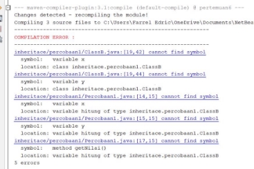
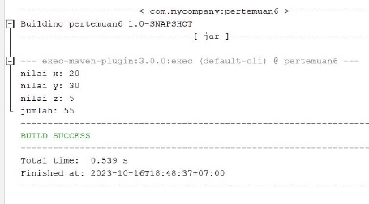
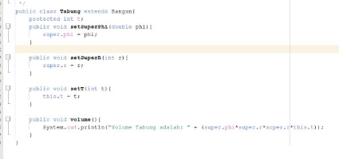
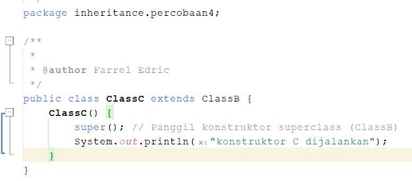

NAMA : Fransiscus Farrel Edric W

NIM : 2241720032 

KELAS  : 2C 

` `P7 

Percobaan 1 Class A 

Class B 

Class percobaan 1 

Hasil run 

**A. PERTANYAAN** 

1. Pada percobaan 1 diatas program yang dijalankan terjadi error, kemudian perbaiki sehingga program tersebut bisa dijalankan dan tidak error!

Di tambahkan konstruktor seper ti di bawah yang hasilnya

- Pada class B 
- 
- Pada class percobaan 1 
- 
- Hasil run 
- 
2. Jelaskan apa penyebab program pada percobaan 1 ketika dijalankan terdapat error!
- Jadi error di sebabkan pada class B tidak terbaca pada get nilai x dan y maka kita tambahkan

Percobaa 2 class A 

class B 

Run 

1. Pada percobaan 2 diatas program yang dijalankan terjadi error, kemudian perbaiki sehingga program tersebut bisa dijalankan dan tidak error!
- Karena harus menambahkan extends dan seter getter 
2. Jelaskan apa penyebab program pada percobaan 2 ketika dijalankan terdapat error!
- Karena tidak ada setter getternya 

PERCOBAAN 3 

Class Bangun 

Class tabung 

Percoabaan 3 

Run 

1. Jelaskan fungsi “super” pada potongan program berikut di class Tabung!

- Untuk classs parent 
2. Jelaskan fungsi “super” dan “this” pada potongan program berikut di class 

Tabung!

- Untuk  menampilkan class perent 
3. Jelaskan mengapa pada class Tabung tidak dideklarasikan atribut “phi” dan “r” tetapi class tersebut dapat mengakses atribut tersebut! 
- atribut phi dan r sebenarnya dideklarasikan di dalam superclass (kelas induk) yang disebut Bangun. Oleh karena itu, kelas Tabung dapat mengakses atribut ini karena kelas anak (subclass) dapat mewarisi atribut dan metode dari kelas induk.

Percobaan 4 Class A 

Class B 

Class  C 

Percobaan 

Run 

1. Pada percobaan 4 sebutkan mana class yang termasuk superclass dan subclass, kemudian jelaskan alasannya!
- Superclass (B,C)
- Sub  class  (A)
2. Ubahlah isi konstruktor default ClassC seperti berikut:
- 
3. Jelaskan bagaimana urutan proses jalannya konstruktor saat objek test dibuat! 

4. Apakah fungsi super() pada potongan program dibawah ini di ClassC!
- Untuk mengidentifikasi class perent 

Tugas 

